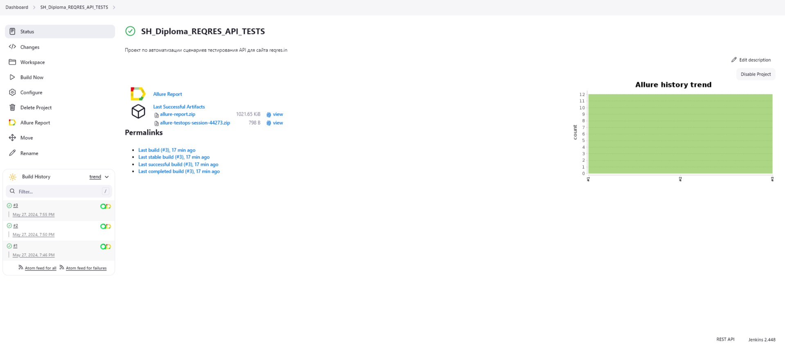
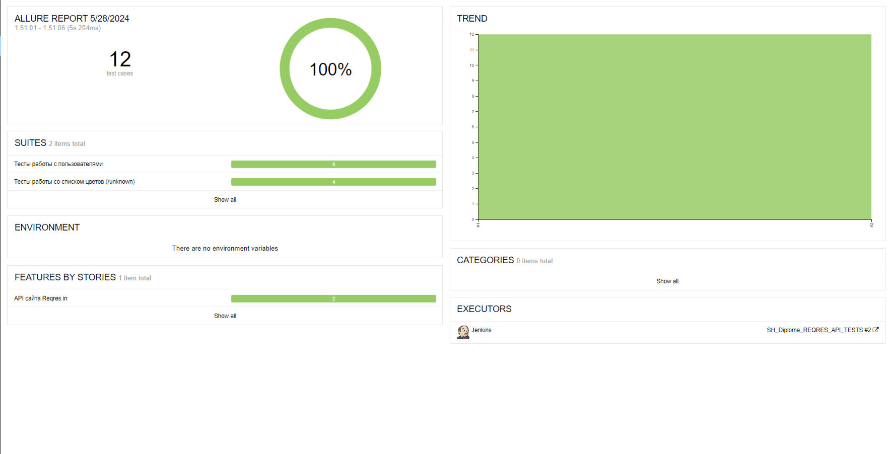
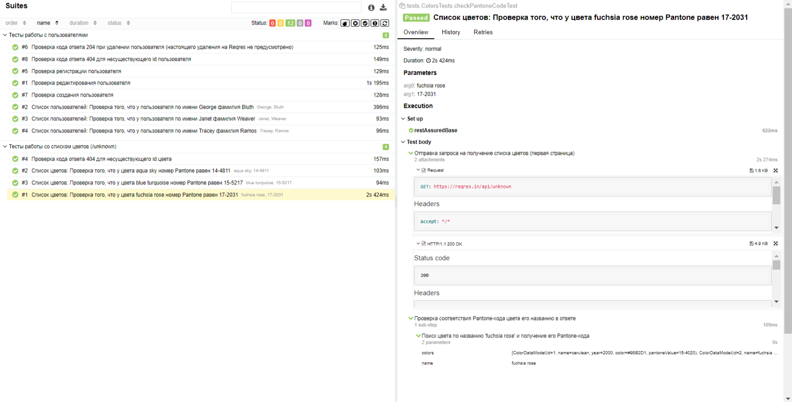
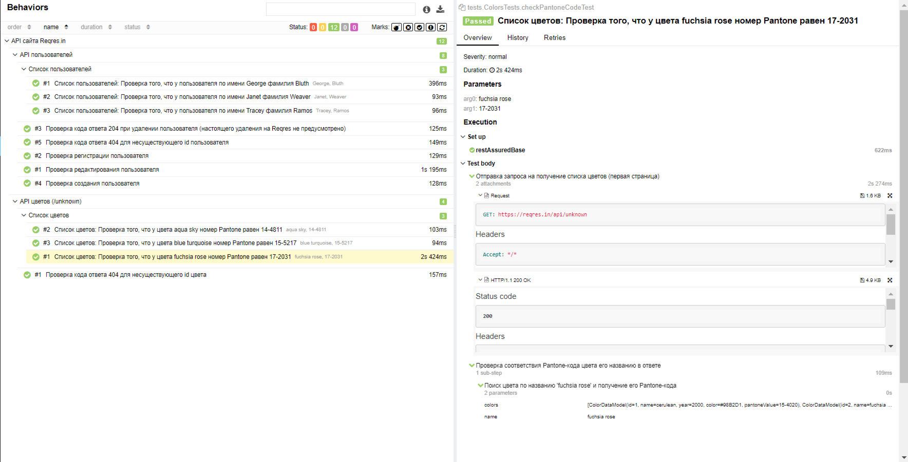
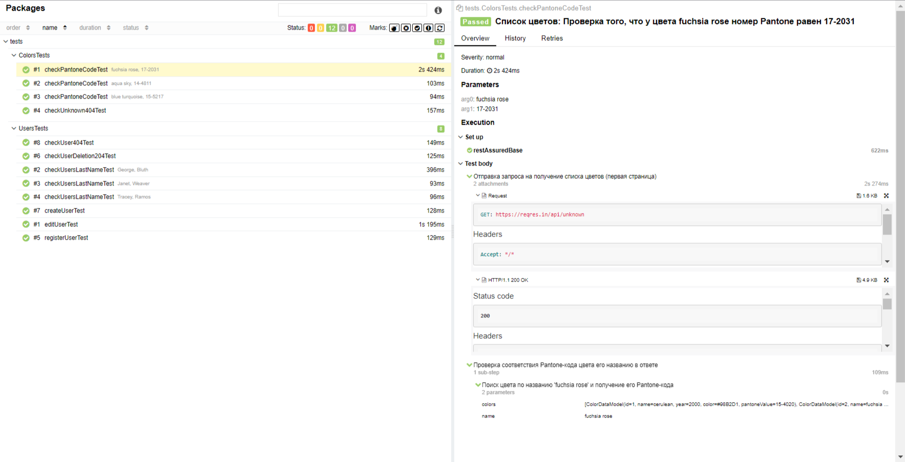
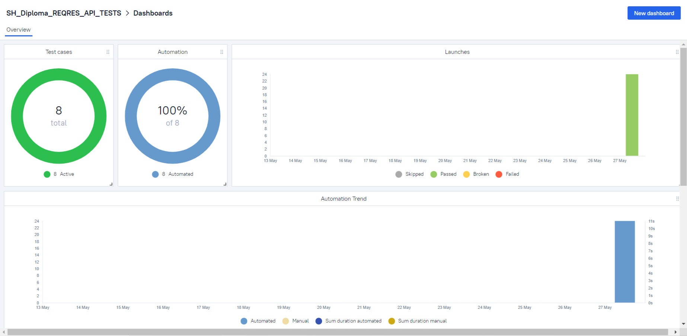
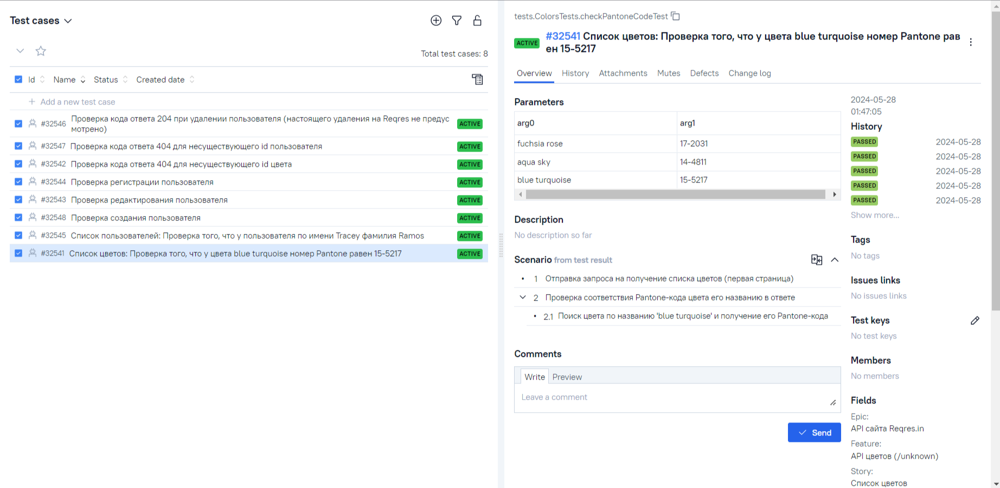
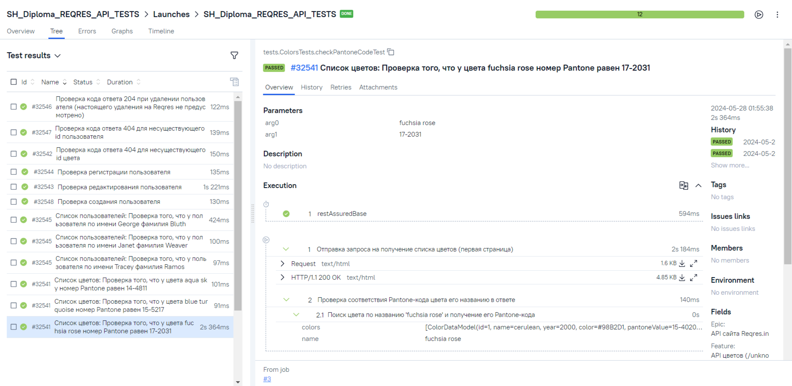
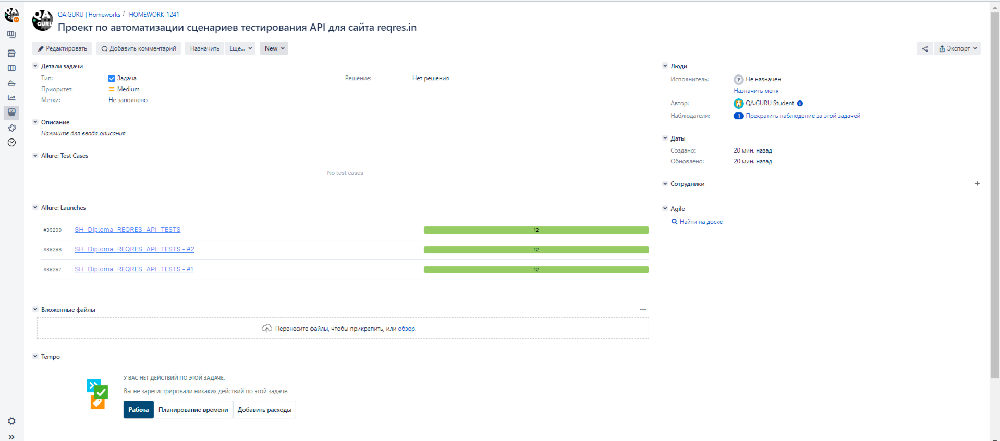

# Проект по автоматизации сценариев тестирования API для сайта reqres.in

REQRES - Протестируйте свой интерфейс на реальном API.

##  Содержание:

- <a href="#stech">Используемый стек технологий и инструментов</a>
- <a href="#check">Реализованные проверки</a>
- <a href="#engine">Запуск автотестов</a>
- <a href="#build">Сборка в Jenkins</a>
- <a href="#report">Интеграция с Allure</a>
- <a href="#testops">Интеграция с Allure TestOps</a>
- <a href="#jira">Интеграция с Jira</a>
- <a href="#telegram">Уведомления в Telegram через бота</a>

<a id="stech"></a>
##  Используемый стек технологий и инструментов

| Java                                                    | IntelliJ  <br>  Idea                                            | GitHub                                                    | JUnit 5                                                   | Gradle                                                    | Selenide                                                    | Allure<br/>Report                                                | Allure <br> TestOps                                               | Jenkins                                                    | Jira                                                    |                                                    Telegram |
|:--------------------------------------------------------|-----------------------------------------------------------------|-----------------------------------------------------------|-----------------------------------------------------------|-----------------------------------------------------------|-------------------------------------------------------------|------------------------------------------------------------------|-------------------------------------------------------------------|------------------------------------------------------------|---------------------------------------------------------|------------------------------------------------------------:|
|  |  |  |  |  |  |  |  |  |  |  |

Тесты в проекте написаны на языке <code>Java</code> с использованием фреймворка  [Selenide](https://selenide.org/) и сборщика <code>Gradle</code>. <code>JUnit 5</code> задействован в качестве фреймворка модульного тестирования.
Для удаленного запуска реализована сборка в <code>Jenkins</code> с формированием Allure-отчета и отправкой результатов в <code>Telegram</code> при помощи бота. Также реализована интеграция с <code>Allure TestOps</code> и <code>Jira</code>.


<a id="chek"></a>
##   Реализованные проверки
- Получение списка существующих пользователей и данных о них
- Получение списка занесённых в API цветов с описанием их кодов в системе Pantone и шестнадцатитеричном формате
- Получение ответа со статусом 404 при запросе несуществующего пользователя/цвета
- Создание пользователя
- Регистрация пользователя
- Редактирование данных пользователя
- Удаление пользователя (так как тренажёр не изменяет при этом список пользователей, проверяется лишь возвращаемый код 204)


<a id="engine"></a>
##  Запуск автотестов


### Запуск тестов из терминала локально:
```
gradle clean test 
```

<a id="build"></a>
##  [Сборка в Jenkins](https://jenkins.autotests.cloud/job/SH_Diploma_REQRES_API_TESTS/)

Для запуска сборки необходимо перейти в раздел **"Build with Parameters"** и нажать кнопку **"Build"**.
<p align="center">
 
</p>

После выполнения сборки, в блоке **Build History** напротив номера сборки появятся значки 
и  , при клике на которые откроются соответствующие
артефакты.

##  [Интеграция с Allure](https://jenkins.autotests.cloud/job/SH_Diploma_REQRES_API_TESTS/allure/)

<a id="report"></a>
### Allure отчет

<p align="center">   
    
</p>

### Подробнее
<p align="center">     
    
</p>       

<p align="center">     
    
</p>  

<p align="center">     
    
</p>  

##  [Интеграция с Allure TestOps](https://allure.autotests.cloud/launch/39383)


<a id="testops"></a>
### Allure TestOps отчет

#### Overview

<p align="center">    

</p>

#### DashBoards
<p align="center">

</p>

#### Подробнее

<p align="center">

</p>


<a id="jira"></a>
##  [Интеграция с Jira](https://jira.autotests.cloud/browse/HOMEWORK-1241)


<p align="center">

</p>

##  [Уведомления в Telegram через бота](https://t.me/HW16Notification)


<a id="telegram"></a>
<p align="center">

</p>
